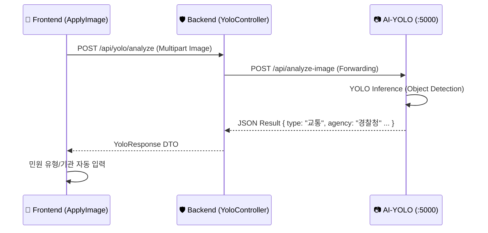

# 📷 YOLO Guide: Visual Classification Service
> **"이미지 한 장으로 민원 유형과 소관 부서를 즉시 판별합니다."**

이 문서는 SafeGuard 프로젝트의 **Visual Classification (시각적 분류)** 엔진인 **AI-YOLO** 서비스의 아키텍처, 기술 스택, 핵심 로직 및 API 명세를 기술합니다.

---

## 1. 개요 (Overview)

**AI-YOLO** 서비스는 사용자가 업로드한 민원 이미지를 분석하여 **민원 유형(Type)**과 **담당 기관(Agency)**을 자동으로 추천해주는 **객체 탐지(Object Detection)** 모듈입니다.

- **핵심 역할**: 이미지 내 불법 주정차, 쓰레기 무단 투기, 현수막 등 특정 민원 요소를 탐지.
- **주요 기능**:
    - **Object Detection**: YOLOv8 모델을 사용하여 이미지 내 객체 위치 및 확률(Confidence) 계산.
    - **Agency Mapping**: 탐지된 객체 라벨(Label)을 행정 기관(예: 경찰청, 국토부)으로 매핑.
    - **Validation**: 5MB 이하 이미지 및 지원 포맷 검증.

### 1.1 비즈니스 컨텍스트 (Business Context)
- **비즈니스 목적**: 사진 한 장만으로 민원 내용을 자동 인식하여, 카테고리 분류의 정확도를 높이고 사용자의 입력 수고를 덜어줍니다.
- **사용자 가치**: 복잡한 행정 용어(예: 보행방해물, 노상적치물)를 몰라도 사진만 찍으면 AI가 알아서 분류해 줍니다.

### 1.2 문제 정의 (Problem Statement)
- **배경**: 텍스트 민원만으로는 현장 상황을 정확히 파악하기 어려워 공무원의 현장 방문 횟수가 증가했습니다.
- **상세**: 시민들이 불법주정차 신고 시 '장애인 구역', '소화전 표지' 등을 구별하지 못해 잘못된 부서로 접수되는 사례가 빈번했습니다.

---

## 2. 기술 스택 (Tech Stack)

| 구분 | 기술/도구 | 버전/설명 |
| :--- | :--- | :--- |
| **Framework** | **FastAPI** | 비동기 고성능 Python 웹 프레임워크 |
| **Model Arch** | **YOLOv8** (Ultralytics) | 객체 탐지 SOTA 모델 (Nano/Small variants used) |
| **Inference** | **PyTorch** (CPU) | `torch`, `torchvision` (CPU-only optimizations) |
| **Image Proc** | **OpenCV** (headless) | 이미지 로딩 및 전처리 |
| **Container** | **Docker** | `python:3.9-slim` 기반 경량 이미지 |
| **Metrics** | **Prometheus Client** | `/metrics` 엔드포인트 제공 |

---

## 3. 파일 구조 (File Structure)

`ai/yolo/` 디렉토리의 구조입니다.

```bash
ai/yolo/
├── app.py                      # FastAPI 메인 애플리케이션 (Entrypoint)
├── analyze_image.py            # YOLO 추론 및 로직 래퍼 (Core Logic)
├── infer_image_complaint.pt    # Custom Fine-tuned YOLO 모델 가중치 파일
├── best.pt                     # 학습 최고 성능 모델 체크포인트
├── Dockerfile                  # 컨테이너 빌드 설정
└── requirements.txt            # Python 의존성 목록
```

---

## 4. 핵심 시스템 로직 (Core Logic)

### 4.1 분류 파이프라인 (Classification Pipeline)
`analyze_image.py`에서 수행되는 전체 분석 과정입니다.

1.  **이미지 수신**: FastAPI `UploadFile`로 이미지 스트림 수신.
2.  **전처리 (Pre-processing)**: 5MB 용량 제한 및 포맷 확인 후 임시 파일 저장.
3.  **모델 추론 (Inference)**:
    - **Model**: `infer_image_complaint.pt` 로드.
    - **Predict**: Confidence Threshold `0.1` 이상인 객체만 탐지.
4.  **후처리 (Post-processing)**:
    - 탐지된 박스(Box) 중 `Confidence`가 가장 높은 객체 1개 선정.
    - 모델 라벨(English/Korean Mixed)을 **표준 민원 유형**으로 변환.
    - 민원 유형을 기반으로 **담당 기관(Agency)** 매핑.
5.  **결과 반환**: JSON 포맷 응답.

### 4.2 기관 매핑 테이블 (Agency Mapping)

YOLO가 탐지한 클래스를 행정 기관으로 매핑하는 규칙입니다. (`analyze_image.py` 참조)

| 탐지 라벨 (Model Label) | 표준 유형 (Type) | 추천 기관 (Agency) |
| :--- | :--- | :--- |
| `불법주정차` | **교통** | 경찰청 |
| `보행방해물` | **도로** | 국토교통부 |
| `쓰레기` | **환경** | 기후에너지환경부 |
| `공사현장` | **주택건축** | 행정안전부 |
| `현수막` | **행정안전** | 행정안전부 |

---

## 5. 프론트엔드 통합 (Integration)

프론트엔드(`ApplyImage.tsx`)는 직접 AI 서버를 호출하지 않고, **백엔드 프록시**를 경유합니다.



---

## 6. API 명세 (API Specification)

### 6.1 이미지 분석 요청
- **URL**: `POST /api/analyze-image`
- **Content-Type**: `multipart/form-data`

#### Request
| Key | Type | Description |
| :--- | :--- | :--- |
| `image` | File | 분석할 이미지 파일 (jpg, png 등) |

#### Response (Success: 200 OK)
```json
{
  "type": "교통",
  "agency": "경찰청",
  "confidence": 0.854
}
```

#### Response (Fail: 400 Bad Request)
```json
{
  "detail": "이미지 용량은 5MB 이하만 업로드 가능합니다."
}
```

---

## 7. 설치 및 실행 (Setup & Run)

### 7.1 Docker 실행 (권장)
루트 디렉토리의 `docker-compose`를 통해 실행합니다.

```bash
# 전체 시스템 실행
docker-compose up -d --build safeguard-ai-yolo

# 로그 확인
docker-compose logs -f safeguard-ai-yolo
```

### 7.2 로컬 개발 환경 실행
Python 3.9+ 환경에서 실행합니다.

```bash
cd ai/yolo

# 의존성 설치
pip install -r requirements.txt

# 서버 시작 (Port 5000)
uvicorn app:app --host 0.0.0.0 --port 5000 --reload
```

---

---

## 8. 요구사항 정의 (Requirements)

### 8.1 기능 요구사항 (Functional)
| ID | 요구사항 | 설명 | 중요도 |
| :-- | :--- | :--- | :--- |
| FR-1 | **객체 탐지** | 업로드된 이미지에서 민원 대상(차량, 쓰레기 등)을 2초 이내에 탐지해야 한다. | Must |
| FR-2 | **기관 매핑** | 탐지된 객체를 5대 행정 기관(경찰청, 국토부 등) 중 하나로 자동 매핑해야 한다. | Must |
| FR-3 | **유효성 검사** | 5MB 이상의 대용량 파일이나 비이미지 파일 업로드 시 차단해야 한다. | Must |

### 8.2 비기능 요구사항 (Non-Functional)
- **정확도**: mAP@50 기준 80% 이상의 탐지 성능 유지.
- **응답성**: 전체 파이프라인(업로드->추론->반환) 처리 시간 **3초 이내**.

---

## 9. 예외 및 오류 처리 (Exception & Error Handling)

### 9.1 주요 오류 시나리오
- **탐지 객체 없음**: 신뢰도 0.1 이상의 객체가 없을 경우, `confidence: 0.0`과 함께 "탐지 불가" 응답 -> 프론트엔드에서 수동 선택 유도.
- **모델 로드 실패**: 서버 시작 시 `.pt` 파일이 없으면 `FileNotFoundError`와 함께 컨테이너 실행 중단(Fail Fast).

---

## 10. 품질 및 정확도 관리 (Quality Control)

### 10.1 품질 보증 전략
- **Custom Dataset**: 한국의 실제 도로 환경(한국형 번호판, 국내 쓰레기 봉투 등) 데이터셋으로 파인튜닝하여 정확도 확보.
- **Thresholding**: 신뢰도 임계값(`conf=0.1`)과 IOU(`iou=0.5`)를 조정하여 중복 탐지(Double Counting) 및 미탐지 최소화.

---

## 11. 보안 설계 (Security Design)

- **이미지 휘발성**: 분석 직후 서버 내 임시 파일(`temp_*.jpg`)을 즉시 삭제(`os.remove`)하여 데이터 유출을 방지합니다.
- **Input Validation**: `image/*` MIME Type 검사를 통해 악성 스크립트 파일 업로드 차단.

---

## 12. 운영 및 모니터링 (Operations & Monitoring)

### 12.1 모니터링 지표 (Prometheus)
- **`http_request_duration_seconds`**: 추론(Inference) 단계의 지연 시간 집중 모니터링 (CPU 부하 감지).
- **`http_requests_total`**: Label별(불법주정차, 쓰레기 등) 탐지 횟수 카운트를 통해 주간 민원 트렌드 파악 가능.

### 12.2 장애 대응
- **CPU 과점유**: 컨테이너 CPU Limit(2.0) 설정으로 타 컨테이너 영향 최소화.

---

## 13. 테스트 전략 (Test Strategy)

- **Unit Test**: `analyze_image.py`의 기관 매핑 로직(`LABEL_TO_TYPE`) 검증.
- **Integration Test**: 
    - `curl`을 사용하여 `samples/traffic.jpg` 전송 시 `{"type": "교통", "agency": "경찰청"}` 응답 확인.
- **Performance Test**: `locust`를 사용하여 동시 10명 접속 시 평균 응답 속도 측정.

---
**[End of Document]**
