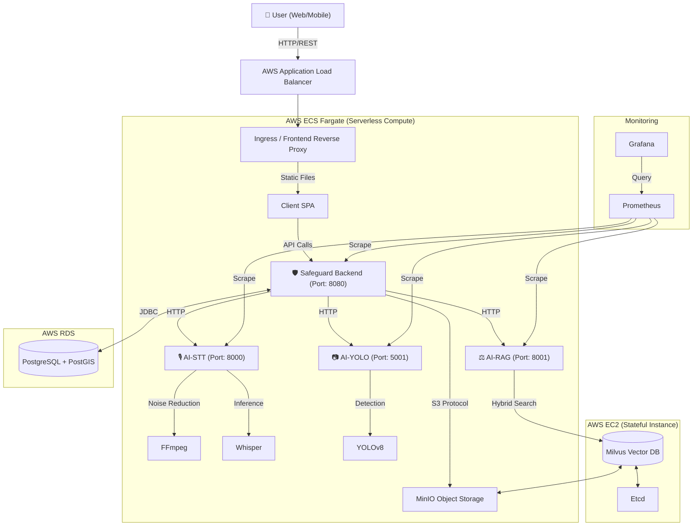
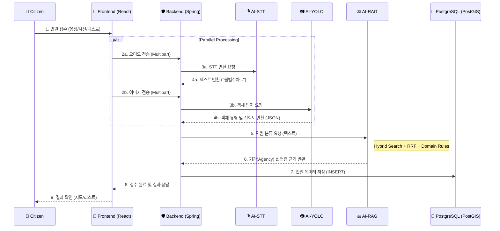
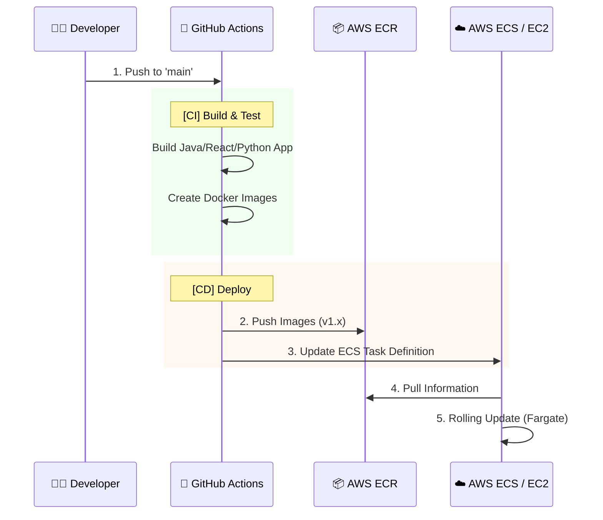

# 🏛 Project SafeGuard: AI 기반 차세대 민원 통합 관리 플랫폼
> **"시민의 목소리를 정확하게, 공무원의 업무를 효율적으로"**
> 최신 AI 기술(LLM-RAG, Speech-to-Text, Computer Vision)이 적용된 지능형 민원 자동 분류 및 통합 처리 시스템

---

## 0️⃣ 문서 개요 (Document Overview)
본 문서는 **SafeGuard** 프로젝트의 시스템 아키텍처, 기술 스택, 핵심 알고리즘 및 데이터 흐름을 코어 수준에서 상세히 기술한 **시스템 백서(System Whitepaper)**입니다. 현재 구축된 코드베이스(`v1.0`)를 기준으로 작성되었습니다.

- **대상 독자**: 시스템 아키텍트, 백엔드/AI 엔지니어, 프로젝트 이해관계자
- **문서 버전**: v2.2 (Precision Review & Sync)
- **최종 수정일**: 2026-01-19

---

## 1️⃣ 핵심 가치 및 목표 (Executive Summary)

### 1.1 해결하고자 하는 문제 (Pain Points)
1.  **민원 접수의 불편함**: 복잡한 카테고리 선택과 긴 텍스트 입력 과정.
2.  **분류의 비효율성**: 담당 공무원이 수동으로 내용을 읽고 부서를 지정해야 함(분류 지연).
3.  **개인정보 유출 위험**: 민원 첨부 사진에 타인의 얼굴이나 차량 번호판이 노출됨.
4.  **불명확한 처리 기준**: 담당자의 주관에 따라 부서가 오배정되는 사례 빈번.

### 1.2 솔루션 (Solution)
- **음성/사진 기반 간편 접수**: STT와 객체 탐지 기술로 입력 장벽 제거.
- **AI 자동 분류 (Hybrid RAG)**: 법령 데이터 기반의 자동 부서 매칭 및 근거 제시.
- **이미지 자동 분석**: 업로드된 이미지에서 민원 요소(불법주정차 등)를 즉시 탐지하여 분류.
- **실시간 관제 대시보드**: 30초 단위 자동 갱신되는 관리자 현황판 제공.

### 1.3 프로젝트 배경 (Background)
디지털 전환(DX) 시대에도 불구하고, 행정 서비스의 문턱은 여전히 높습니다. 특히 고령층이나 디지털 소외계층에게 복잡한 웹 서식이나 키보드 입력은 큰 장벽입니다. **SafeGuard**는 "기술이 사람을 돕는다"는 비전 아래, 누구나 말 한마디, 사진 한 장으로 쉽게 민원을 제기하고, 공무원은 AI의 도움으로 이를 신속하게 처리할 수 있는 세상을 목표로 합니다.

### 1.4 우리가 선택한 분류 체계 (Scope of Classification)
SafeGuard는 대한민국의 행정 현실을 반영하여 **21개 핵심 정부 부처**와 **5대 생활 불편 요소**를 집중 관리 대상으로 선정했습니다.

#### A. 21개 담당 기관 (Government Agencies)
AI-RAG 엔진이 분석하여 배정하는 행정 기관 목록입니다.
1. 경찰청 (18)
2. 국토교통부 (19)
3. 고용노동부 (20)
4. 국방부 (21)
5. 국민권익위원회 (22)
6. 식품의약품안전처 (23)
7. 대검찰청 (24)
8. 기획재정부 (25)
9. 행정안전부 (26)
10. 보건복지부 (27)
11. 과학기술정보통신부 (28)
12. 국세청 (29)
13. 기후에너지환경부 (30)
14. 법무부 (31)
15. 공정거래위원회 (32)
16. 교육부 (33)
17. 해양수산부 (34)
18. 농림축산식품부 (35)
19. 소방청 (36)
20. 인사혁신처 (37)
21. 기타 (38)

#### B. 5대 생활 불편 요소 (YOLO Visual Types)
AI-YOLO 시각 지능이 즉시 탐지하는 객체 유형입니다.
1. **불법주정차** (Illegal Parking) -> 경찰청
2. **보행방해물** (Obstacle) -> 국토교통부
3. **쓰레기 무단투기** (Trash) -> 기후에너지환경부
4. **공사현장 안전미흡** (Construction) -> 행정안전부
5. **불법 현수막** (Banner) -> 행정안전부

---

## 2️⃣ 시스템 아키텍처 (System Architecture)

본 시스템은 **AWS Hybrid Cloud Architecture**로 설계되었습니다.
메인 애플리케이션(Frontend, Backend, Stateless AI)은 유연한 확장을 위해 **AWS ECS Fargate** 서버리스 환경에서 구동되며, 고성능 벡터 연산과 데이터 지속성이 필요한 **Milvus DB**는 **AWS EC2** 전용 인스턴스에서 실행됩니다. 모든 서비스는 `safeguard-network` 내부 브리지 네트워크(VPC)를 통해 격리된 통신을 수행합니다.

### 2.1 아키텍처 다이어그램 (Logical View)



### 2.2 인프라 및 네트워크 구성 (Infrastructure)
| 서비스명 | 호스팅 환경 | 컨테이너 명 | 포트 (Host:Container) | 역할 및 설명 |
| :--- | :--- | :--- | :--- | :--- |
| **Frontend** | **AWS ECS Fargate** | `safeguard-frontend` | **80**:80 | React SPA 호스팅 (Nginx). `ai-yolo`, `backend` 의존성 보유. |
| **Backend** | **AWS ECS Fargate** | `safeguard-backend` | **8080**:8080 | 핵심 비즈니스 로직, 인증, 데이터 관리. |
| **AI-STT** | **AWS ECS Fargate** | `safeguard-ai-stt` | **8000**:8000 | 음성 -> 텍스트 변환 및 전처리 엔진 (Whisper). |
| **AI-RAG** | **AWS ECS Fargate** | `safeguard-ai-rag` | **8001**:8001 | 민원 분류 및 법령 하이브리드 검색 엔진. |
| **AI-YOLO** | **AWS ECS Fargate** | `safeguard-ai-yolo` | **5001**:5000 | 이미지 객체 탐지 및 민원 유형 분류 엔진. |
| **Database** | **AWS RDS** | `safeguard-db` | **5433**:5432 | PostgreSQL 16 + PostGIS. 민원 및 위치 데이터 저장. |
| **Milvus** | **AWS EC2** | `milvus-standalone` | **19530**:19530 | 벡터 데이터베이스. (Stateful 특성상 EC2 전용 인스턴스 사용) |
| **MinIO** | **AWS EC2** | `milvus-minio` | **9001**:9001 | 객체 스토리지 (S3 호환 / 로컬용). |

### 2.3 스토리지 구성 (Storage & Buckets)
이미지, 음성, 로그 등 비정형 데이터는 **S3 호환 스토리지**를 통해 관리됩니다.

| 환경 (Environment) | 스토리지 서비스 | 버킷 이름 (`bucket_name`) | 용도 |
| :--- | :--- | :--- | :--- |
| **Production** | **AWS S3** | `safeguard-bukket` | 실제 민원 첨부 파일(이미지/음성) 영구 저장 |
| **Local / Dev** | **MinIO** (Self-hosted) | `safeguard-bukket` | 로컬 개발 시 S3 API 에뮬레이션 |

- **저장 데이터**:
  - `complaint-images/`: 민원인 업로드 현장 사진 (`.jpg`, `.png`)
  - `voice-records/`: 민원 접수된 음성 녹음 파일 (`.webm`, `.wav`)
  - `milvus-vectors/`: 벡터 DB 스냅샷 및 로그

### 2.4 컨테이너 오케스트레이션 (Docker Composition)
`docker-compose.yml`을 통해 정의된 8개 컨테이너의 상호작용 및 설정입니다.

#### A. 네트워크 토폴로지 (Network Topology)
- **Network Name**: `safeguard-network` (Bridge Driver)
- **Isolation**: 외부와 격리된 내부망을 형성하여, 컨테이너 간에는 `http://backend:8080`, `http://ai-rag:8001` 등 **서비스 이름(Service Discovery)**으로 통신합니다.

#### B. 볼륨 및 데이터 지속성 (Volumes)
컨테이너가 재시작되어도 데이터가 유실되지 않도록 마운트된 볼륨입니다.
1. **Database**: `postgres_data_16` -> Postgres 데이터 보존
2. **Milvus Stack**:
    - `./milvus-etcd-data` -> 메타데이터
    - `./milvus-minio-data` -> 벡터/오브젝트 데이터
    - `./milvus-data` -> Milvus 로그 및 설정
3. **Shared Resources**:
    - `./uploads` -> 사용자가 업로드한 파일을 Backend가 저장하고, Frontend(Nginx)가 서빙할 수 있도록 공유.

#### C. 서비스 의존성 (Depends On)
안정적인 부팅 순서를 보장하기 위한 `depends_on` 설정입니다.
- `backend` waits for `db` (Health Check 통과 시까지 대기)
- `milvus` waits for `etcd`, `minio`
- `ai-rag` waits for `milvus`
- `frontend` waits for `backend`, `ai-yolo`

---

## 3️⃣ 상세 기술 스택 (Detailed Technology Stack)

### 3.1 Frontend (User Interface)
| Category | Technology | Version | Description |
| :--- | :--- | :--- | :--- |
| **Core** | **React** | **v19.2.0** | 최신 UI 라이브러리 (Server Components 호환) |
| **Build** | **Vite** | **v7.2.4** | 초고속 HMR 지원 빌드 도구 |
| **Language** | TypeScript | v5.3.3 | 정적 타입 안정성 확보 |
| **Styling** | **Tailwind CSS** | **v4.1.18** | Utility-first CSS 프레임워크 (TailAdmin 기반) |
| **Routing** | React Router | v7.11.0 | SPA 라우팅 처리 |
| **Visualization** | **ApexCharts** | v5.3.6 | 실시간 대시보드 차트 렌더링 |
| **Maps** | Kakao Map API | - | 클러스터링 및 폴리곤(Hotspot) 시각화 |
| **UI Components** | Lucide React | v0.562.0 | 경량화된 아이콘 라이브러리 |
| **Animation** | Framer Motion | v12.25.0 | 자연스러운 UI 전환 애니메이션 |

### 3.2 Backend (Core System)
| Category | Technology | Version | Description |
| :--- | :--- | :--- | :--- |
| **Framework** | **Spring Boot** | **v3.4.1** | 엔터프라이즈급 백엔드 애플리케이션 프레임워크 |
| **Language** | **Java** | **17 (LTS)** | 안정성과 성능을 보장하는 LTS 버전 |
| **ORM (Hybrid)** | **MyBatis** | v3.0.4 | 복잡한 통계/대시보드 쿼리 최적화 |
| | **Hibernate Spatial** | - | PostgreSQL PostGIS 지리 정보(GIS) 처리 |
| **Database** | **PostgreSQL** | **v16.0** | 관계형 데이터 및 지리 정보(PostGIS) 저장 |
| **Security** | Spring Security | - | JWT 기반 Stateless 인증/인가 (`io.jsonwebtoken:0.11.5`) |
| **Storage** | AWS SDK (S3) | v3.3.0 | MinIO Object Storage 연동 |
| **API Docs** | Swagger UI | - | API 명세 자동화 (Optional) |

### 3.3 AI Service Mesh (Microservices)
모든 AI 서비스는 **Python 3.9+** 및 **FastAPI (v0.109+)** 기반으로 구축되었습니다.

#### A. STT (Speech-to-Text)
| Library | Version | Role |
| :--- | :--- | :--- |
| **OpenAI Whisper** | `base` model | 다국어/한국어 음성 인식 엔진 |
| **FFmpeg** | `afftdn` filter | **[Core]** 주파수 기반 배경 소음 제거 |
| **ffmpeg-normalize** | - | 오디오 볼륨 평탄화 (EBU R128 표준) |

#### B. RAG (Retrieval-Augmented Generation)
| Library | Version | Role |
| :--- | :--- | :--- |
| **PyMilvus** | v2.3.0 | 고성능 벡터 데이터베이스 클라이언트 |
| **Sentence-Transformers** | v2.3.0 | 한국어/다국어 임베딩 모델 (`paraphrase-multilingual-MiniLM-L12-v2`) |
| **Kiwipiepy** | v0.16.2 | 한국어 형태소 분석기 (명사 추출) |
| **Rank-BM25** | v0.2.2 | 키워드 기반 검색 알고리즘 |

#### C. YOLO (Visual Classification)
| Library | Version | Role |
| :--- | :--- | :--- |
| **Ultralytics YOLO** | **v8 (YOLOv8)** | 객체 탐지 SOTA 모델 |
| **OpenCV** | headless | 고속 이미지 전처리 |
| **PyTorch** | - | 딥러닝 추론 엔진 (CPU Optimization) |

### 3.4 Infrastructure & DevOps
| Category | Tool | Description |
| :--- | :--- | :--- |
| **Container** | **Docker Compose** | 멀티 컨테이너 오케스트레이션 |
| **Proxy** | Nginx | 리버스 프록시 및 정적 파일 서빙 |
| **Monitoring** | **Prometheus** | 매트릭 수집 (`http_requests_total` 등) |
| **Storage** | **MinIO** | S3 호환 로컬 오브젝트 스토리지 |
| **Vector DB** | **Milvus Standalone** | RAG용 벡터 검색 엔진 |

| **Vector DB** | **Milvus Standalone** | RAG용 벡터 검색 엔진 |

### 3.5 개발 환경 표준 (Development Standards)
프로젝트 팀원들이 사용하는 표준 개발 환경 및 도구입니다.
| Category | Tool | Detail |
| :--- | :--- | :--- |
| **OS** | **macOS** (Sonoma+) | 기준 운영체제 (Linux 호환성 확보). |
| **IDE** | **VS Code** | Frontend/AI 개발용. (Extensions: ESLint, Prettier, Python). |
| | **IntelliJ IDEA** | Backend (Spring Boot) 개발용. |
| **API Test** | **Postman** | API 엔드포인트 테스트 및 문서화. |
| **DB Client** | **DBeaver** | PostgreSQL 및 Milvus 데이터 확인. |
| **Virtualization** | **Docker Desktop** | 로컬 컨테이너 구동 및 테스트. |
| **Version Control** | **Git** (GitHub) | Feature Branch Flow 전략 사용. |

---

## 4️⃣ 데이터 처리 흐름 (End-to-End Data Flow)

### 4.1 민원 접수 및 처리 프로세스
1.  **사용자 입력**: 웹 브라우저에서 음성 녹음 또는 텍스트 입력, 사진 업로드.
2.  **프론트엔드 처리**:
    - `MediaRecorder API`로 오디오 Blob 생성.
    - `Web Speech API`로 실시간 자막 미리보기 제공.
3.  **백엔드 수신 및 오케스트레이션**:
    - `Multipart/form-data`로 오디오/이미지 수신.
4.  **병렬 AI 처리**:
    - **(Async) 이미지 처리**: `AI-YOLO` 서버로 전송 → 객체 탐지 및 기관 매핑 수행.
    - **(Sync) 음성 분석**: `AI-STT` 서버로 전송 → 텍스트 변환 결과 수신.
    - **(Sync) 분류/추천**: 변환된 텍스트를 `AI-RAG` 서버로 전송 → 담당 기관(Agency) 및 법령 근거 수신.
5.  **저장 및 응답**:
    - 변환된 텍스트, 이미지 경로, 추천된 기관 정보를 DB에 저장(`Insert`).
    - 사용자에게 접수 완료 메시지 및 예상 민원 분류 결과 즉시 반환.

### 4.2 시스템 데이터 흐름도 (Data Processing Sequence)



---

## 5️⃣ 상세 시스템 로직 (Deep Dive Logic)

### 5.1 STT 환각/소음 제어 로직
단순히 모델만 돌리는 것이 아니라, 실제 운영 환경의 잡음을 고려한 전처리 파이프라인이 핵심입니다.
- **Noise Reduction**: `ffmpeg -af afftdn` 필터를 사용하여 FFT(고속 푸리에 변환) 기반으로 지속적인 배경 소음을 제거합니다.
- **Whisper Option**: `condition_on_previous_text=False` 및 `no_speech_threshold=0.6` 설정을 통해 이전 문맥 의존이나 무의미한 환각(Hallucination) 현상을 차단합니다.
- **Post-Processing**: `UnifiedComplaintManager._filter_hallucination` 함수에서 5글자 미만의 무의미한 결과나 특수문자 반복을 `ValueError` 처리하여 DB 오염을 방지합니다.

### 5.2 RAG 분류 결정 로직 (Hierarchical Decision)
단순 검색 결과(Retrieval)를 넘어, **행정 도메인 특화 룰(Rule)**을 결합하여 최종 분류를 결정합니다.

#### Step 1: Hybrid Retrieval (query.py)
- **Vector Search** (의미) + **BM25** (키워드) 실행.
- **RRF (Reciprocal Rank Fusion)** 알고리즘으로 상위 법령 5개 추출 및 재정렬.

#### Step 2: Decision Making (classification_service.py)
- **Keyword Bonus**: 사용자 질문에 '주차', '소음' 등 강력한 도메인 힌트가 있으면 해당 기관 점수 부스팅 (+3.0).
- **Broad Law Penalty**: '민원 처리에 관한 법률', '행정절차법' 등 범용 법령은 가중치를 대폭 낮춤(0.35x).
- **MOIS Guard (행안부 방어)**: '재난', '등본' 등 특정 문맥이 없으면 행안부 점수를 강제로 제한(0.8 Cap)하여 쏠림 방지.
- **Thresholding**: 1순위와 2순위의 점수 차이가 미미하거나(`Gap < 0.4`), 전체 신뢰도가 낮으면(`Confidence < 0.45`) '기타'로 분류.

### 5.3 지리정보 시각화 (GIS & Map)
- **Kakao Map API**: `MapView.tsx`에서 클러스터링(`MarkerClusterer`)을 통해 대량의 마커를 효율적으로 렌더링.
- **Hotspot Visualization**: 단순 마커 뷰 외에, 민원 밀집 지역을 색상 스펙트럼(Blue -> Red)으로 표현하는 '핫스팟 모드' 제공 (Polygon Rendering).

### 5.4 대시보드 리얼타임 아키텍처
- **Polling vs Socket**: 현재는 안정성을 위해 **Short Polling** 방식을 최적화하여 사용.
- **30s Timer**: 프론트엔드(`Dashboard.tsx`) 내에서 `setInterval` 타이머가 동작하며, 0초 도달 시 `refreshKey` State를 변경.
- **Refresh Flow**: `refreshKey`가 변경되면 하위 모든 차트 컴포넌트(`ComplaintTrendChart` 등)가 `useEffect`를 트리거하여 백엔드의 `/api/complaints/stats` API를 병렬 호출. 사용자 개입 없이 항상 최신 1분 내의 데이터를 유지함.

---

## 6️⃣ API 인터페이스 (Internal API Specs)

### 6.1 AI-STT (`:8000`)
- `POST /upload_voice`: 오디오 파일 업로드 → 노이즈 제거 → Whisper STT → 텍스트 반환.
- `POST /process_voice`: (텍스트 fallback) 직접 입력된 텍스트에 대한 환각 필터링 및 분석.

### 6.2 AI-RAG (`:8001`)
- `POST /classify`: 질의 텍스트 → 하이브리드 검색 → 기관(Agency) 및 법령 근거 반환.

### 6.3 AI-YOLO (`:5000`)
- `POST /analyze-image`: 이미지 업로드 → 객체 탐지(YOLOv8) → 민원 유형(JSON) 반환.
  *(Frontend는 Backend Proxy `/api/yolo/analyze`를 통해 호출)*

### 6.4 Backend Main (`:8080`)
- `GET /api/complaints/stats/dashboard`: 대시보드용 KPI 및 시계열 통계 집계.
- `POST /api/complaints`: 멀티파트(이미지/오디오) 민원 접수 및 파이프라인 트리거.
- `GET /api/gis/map-items`: 지도용 경량 마커 및 클러스터 데이터 반환.


---

## 7️⃣ 운영 및 유지보수

### 7.1 모니터링 (Observability)
- 각 AI 서비스는 `prometheus-client`를 통해 `/metrics` 엔드포인트를 노출하고 있습니다.
- 수집 지표: `http_requests_total` (요청 수), `http_request_duration_seconds` (응답 속도).

### 7.2 배포 자동화 (CI/CD Pipeline)
GitHub Actions를 통해 코드 푸시부터 서버 배포까지의 과정을 100% 자동화했습니다.



### 7.3 로컬-운영 환경 차이
- **Local**: `docker-compose up`으로 내 컴퓨터에서 즉시 실행 (가짜 DB 사용 가능).
- **Production**: AWS Pipeline을 타고 **Fargate(App)**와 **EC2(DB)**로 배포됨.
```bash
# 전체 시스템 빌드 및 실행 (Detached Mode)
docker-compose up -d --build
```
- 초기 데이터 적재: PostGIS, Milvus 초기화 스크립트 자동 실행.
- 재시작 정책: `restart: unless-stopped` (서버 재부팅 시 자동 복구).

---

## 8️⃣ 한계 및 기술 부채 (Limitations & Tech Debt)
- **JWT Secret**: 현재 설정 파일 내 하드코딩 되어있어, 운영 배포 시 환경 변수(`System.getenv`) 처리로 리팩토링 필요.
- **트래픽 확장성**: 단일 Docker Host 구성으로, 트래픽 급증 시 Kubernetes(K8s) 등의 오케스트레이션 도구 도입 고려 필요.

---
**[End of Document]**
