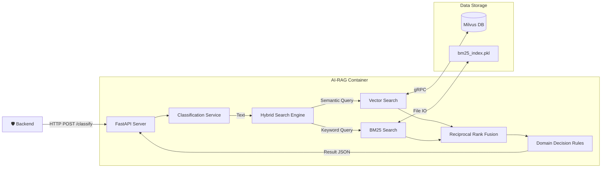
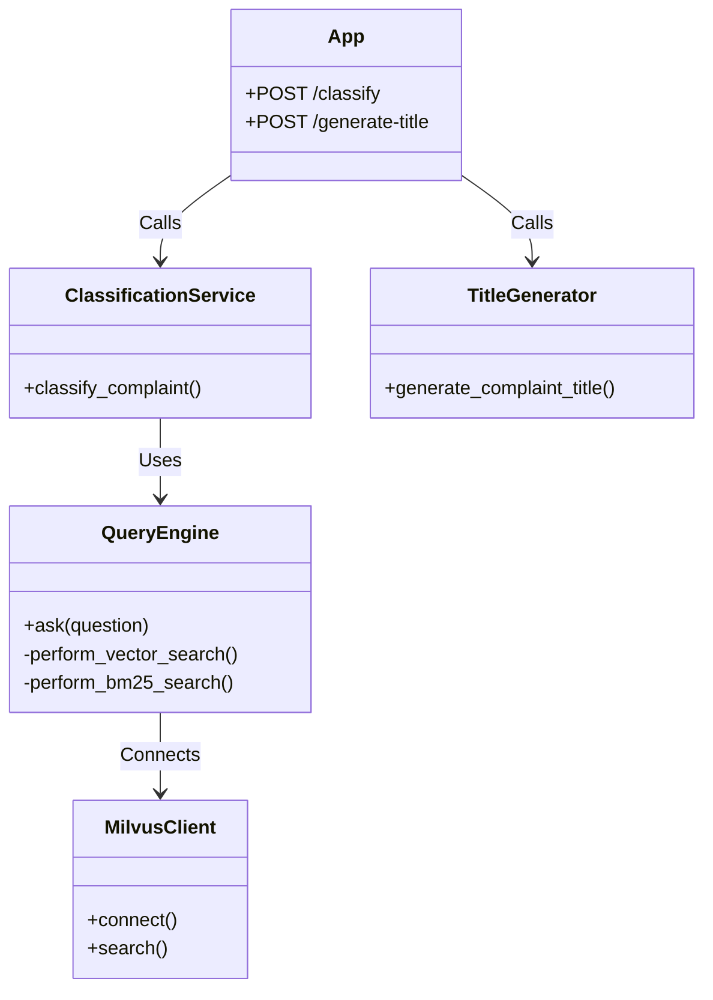

# SafeGuard RAG Guide

## 1. 개요 (Overview)
RAG 서비스는 사용자의 민원 텍스트를 분석하여 적절한 담당 행정 기관을 분류하고, 민원 제목을 자동 생성하는 핵심 AI 모듈입니다.
법령 데이터베이스(Vector DB)를 기반으로 한 하이브리드 검색과 규칙 기반 분류 로직을 결합하여 높은 정확도를 제공합니다.
Docker 컨테이너 환경(`safeguard-ai-rag`)에서 실행되며, FastAPI를 통해 외부 시스템과 통신합니다.

### 1.1 비즈니스 컨텍스트 (Business Context)
- **비즈니스 목적**: 민원 처리의 첫 단추인 '부서 배정'을 자동화하여 공무원의 행정 비용을 절감하고, 민원 처리 속도를 획기적으로 개선합니다.
- **사용자 가치**: 민원인은 복잡한 부서 찾기 없이 내용을 적기만 하면 되며(UX 개선), 담당 공무원은 오배정 민원 이송 업무에서 해방됩니다.

### 1.2 문제 정의 (Problem Statement)
- **배경**: 기존에는 민원인이 직접 카테고리를 선택해야 했으며, 잘못 선택 시 담당 공무원이 수동으로 재분류해야 하는 비효율이 존재했습니다.
- **상세**: 특히 '도로'와 '건설', '환경'과 '위생' 등 경계가 모호한 민원의 오분류율이 높았습니다.

### 1.3 시스템 흐름도 (System Flow)
RAG 서비스가 외부 시스템(Backend) 및 내부 데이터 저장소(Milvus)와 상호작용하는 전체 흐름입니다.



---

---

## 1.1. 기술 스택 (Technical Stack)

| 구분 | 기술 / 라이브러리 | 용도 |
| :--- | :--- | :--- |
| **Language** | Python 3.9 | AI 서비스 메인 언어 |
| **Framework** | FastAPI | 고성능 API 서버 구축 |
| **Vector DB** | Milvus 2.3 | 법령 데이터 벡터 저장소 |
| **Search (Hybrid)** | SentenceTransformers, Rank_BM25 | 의미 검색(Semantic) + 키워드 검색(Lexical) |
| **NLP** | Kiwipiepy | 한국어 형태소 분석기 |
| **Infra** | Docker, MinIO, Etcd | 컨테이너 및 데이터 스토리지 구성 |

---

## 2. 파일 구조 및 역할 (File Structure and Roles)
각 파일의 역할과 내부 핵심 기능을 상세히 기술합니다.

### 2.0 연동 구조 (Implementation Structure)
각 파이썬 모듈이 어떻게 유기적으로 연결되어 동작하는지 보여주는 클래스/모듈 다이어그램입니다.



### 2.1. `app.py`
**역할**: RAG 서비스의 엔트리포인트이자 API 서버입니다. FastAPI 프레임워크를 기반으로 HTTP 요청을 처리합니다.

- **주요 엔드포인트**:
  - `POST /classify`: 민원 텍스트를 입력받아 최종 기관 분류 결과를 반환합니다. `classification_service.py`의 로직을 호출합니다.
  - `POST /generate-title`: 민원 내용과 주소를 받아 제목을 생성합니다. `complainttitle.py`의 로직을 호출합니다.
  - `GET /health`: 서버의 상태(Health Check)를 반환합니다.
- **주요 기능**:
  - 서버 시작 시(`startup_event`) `milvus_client`를 통해 데이터베이스 연결을 초기화합니다.
  - CORS 설정을 통해 프론트엔드 등 외부 도메인에서의 접근을 허용합니다.
  - Pydantic 모델(`ComplaintInput`, `TitleGenInput`)을 사용하여 입력 데이터의 유효성을 검사합니다.

### 2.2. `classification_service.py`
**역할**: 검색 엔진에서 가져온 법령 데이터와 사용자 입력을 종합하여 최종 '행정 기관'을 결정하는 도메인 로직 계층입니다.

- **핵심 함수**: `classify_complaint(user_query)`
- **분류 알고리즘 (Logic Flow)**:
  1.  **전처리 (Preprocessing)**: 입력 텍스트의 공백을 제거하여 정규화합니다.
  2.  **강제 규칙 (Hard Rules)**:
      - "불법 주정자" 등 명확한 패턴이 발견되면 복잡한 검색 과정을 생략하고 즉시 '경찰청'으로 분류합니다.
      - 이는 오분류를 방지하고 응답 속도를 최적화하는 역할을 합니다.
  3.  **검색 (Retrieval)**: `query.py`의 `ask()` 함수를 호출하여 관련 법령 문서를 가져옵니다.
  4.  **점수 산정 (Scoring)**:
      - 검색된 법령 파일명과 본문에 포함된 키워드를 분석하여 기관별 점수를 매깁니다.
      - 범용 법령(지방자치법 등)은 가중치를 낮추어 특정 기관으로 쏠리는 현상을 방지합니다 (Penalty Logic).
      - 사용자 질문에 포함된 키워드와 일치하는 기관에는 가중치를 더 부여합니다 (Bonus Logic).
  5.  **최종 결정 (Decision)**: 가장 높은 점수를 획득한 기관을 선정하고, 신뢰도(Confidence)와 판단 근거(Reasoning)를 생성합니다.

#### 2.2.1 프로세싱 흐름도 (Processing Logic)
`classification_service.py` 내부에서 일어나는 민원 분류의 단계별 상세 로직입니다.

```mermaid
flowchart TD
    Start([User Input]) --> Preprocess[텍스트 전처리/정규화]
    Preprocess --> HardRule{특정 키워드 발견?}
    
    HardRule -- Yes (불법주정차 등) --> Instant[즉시 분류 (Hard Rule)]
    HardRule -- No --> Search[Hybrid Search 실행]
    
    subgraph "Retrieval & fusion"
        Search --> Vec[Vector Search (Milvus)]
        Search --> Key[BM25 Search (Kiwi)]
        Vec & Key --> RRF[RRF 랭킹 융합]
    end
    
    RRF --> Scoring[기본 점수 산정]
    
    subgraph "Domain Rules"
        Scoring --> Bonus[Keyword Bonus (+Score)]
        Bonus --> Penalty[Broad Law Penalty (*0.3)]
        Penalty --> Mois[MOIS Guard (행안부 쏠림 방지)]
    end
    
    Mois --> Threshold{Top1 - Top2 < 0.4 OR Conf < 0.45?}
    
    Threshold -- Yes --> Unknown[기분류 '기타']
    Threshold -- No --> Success[최종 기관 선정]
    
    Instant --> Result([JSON Result])
    Unknown --> Result
    Success --> Result
```

### 2.3. `query.py`
**역할**: 사용자의 질문에 대해 실제 데이터베이스 검색을 수행하는 검색 엔진 모듈입니다.

- **핵심 함수**: `ask(question, top_k)`
- **검색 전략 (Hybrid Search)**:
  - **Vector Search (`perform_vector_search`)**:
    - `SentenceTransformer` 모델을 사용하여 질문을 384차원 벡터로 변환합니다.
    - Milvus DB에서 코사인 유사도(Cosine Similarity)가 높은 문서를 찾습니다. (의미 기반 검색)
  - **Keyword Search (`perform_bm25_search`)**:
    - `Kiwipiepy` 형태소 분석기를 사용하여 질문을 토큰화합니다.
    - 사전에 생성된 `BM25` 인덱스를 통해 키워드 매칭 점수가 높은 문서를 찾습니다. (단어 기반 검색)
  - **RRF (Reciprocal Rank Fusion)**:
    - 위 두 가지 검색 결과를 `1 / (k + rank)` 공식을 사용하여 하나의 순위로 통합합니다.
    - 이를 통해 의미적 유사성과 키워드 정확도를 모두 고려한 최적의 문서를 반환합니다.

### 2.4. `complainttitle.py`
**역할**: 민원 텍스트를 분석하여 사용자가 보기 편한 제목을 자동으로 생성하는 유틸리티 모듈입니다.

- **핵심 함수**: `generate_complaint_title(text, address, type)`
- **요약 알고리즘 (Priority Logic)**:
  1.  **장소 우선 (Location First)**: 텍스트에서 '역', '학교', '아파트' 등의 장소 명사가 발견되면 이를 제목의 핵심으로 사용합니다. (예: "사릉역 앞")
  2.  **행위 우선 (Act First)**: 장소가 없다면 '주정차', '소음', '쓰레기' 등의 행위 명사를 사용합니다.
  3.  **단순 요약 (Fallback)**: 위 키워드가 모두 없다면 문장의 앞부분(12자)을 잘라서 사용합니다.
- **주소 정규화**: 복잡한 전체 주소에서 시/군/구 단위(예: "경기도 남양주시")까지만 추출하여 가독성을 높입니다.
- **형태소 분석**: `Kiwipiepy` 라이브러리를 사용하여 명사(NNG, NNP)를 정확하게 추출합니다.

### 2.5. `ingest.py`
**역할**: PDF 형태의 법령 데이터를 읽어 벡터 데이터베이스(Milvus)에 적재하는 데이터 파이프라인 스크립트입니다.

- **실행 시점**: 시스템 초기 구축 시 또는 법령 데이터가 업데이트되었을 때 1회 실행합니다.
- **처리 과정 (Pipeline)**:
  1.  **Text Extraction**: `pdfplumber`를 사용하여 PDF 파일에서 텍스트를 추출합니다.
  2.  **Chunking**: 긴 텍스트를 500자 단위로 자르고, 100자씩 겹치게(Overlap) 하여 문맥이 끊기지 않도록 합니다.
  3.  **Embedding**: `SentenceTransformer` 모델을 사용하여 각 청크를 벡터로 변환합니다.
  4.  **Indexing**: BM25 검색을 위한 역색인(Inverted Index)을 생성하여 로컬 파일(`bm25_index.pkl`)로 저장합니다.
  5.  **Storage**: 벡터 데이터와 메타데이터를 Milvus DB에 Insert 합니다.

### 2.6. `milvus_client.py`
**역할**: Milvus 데이터베이스와의 연결, 컬렉션 생성, 인덱스 관리를 전담하는 모듈입니다.

- **주요 기능**:
  - `connect_milvus()`: Docker 네트워크상의 Milvus 서버에 접속합니다.
  - `create_collection()`: 데이터 스키마(ID, Embedding, Text, Source)를 정의하고 컬렉션을 생성합니다.
  - `get_collection()`: 다른 모듈(ingest, query)에서 컬렉션 객체를 요청할 때 안전하게 반환합니다.

### 2.7. `logging_config.py`
**역할**: 애플리케이션의 로그 포맷을 JSON 형태로 표준화하여 컨테이너 환경에서의 로그 수집 및 분석을 돕습니다.
- **주요 기능**: `setup_logging()` 함수를 통해 루트 로거를 초기화하고 `python-json-logger`를 적용합니다.

### 2.8. `Dockerfile` & `requirements.txt`
**역할**: RAG 서비스의 실행 환경을 정의합니다.
- **Dockerfile**: Python 3.9-slim 기반 이미지, PyTorch(CPU), 필수 의존성 설치 및 8001번 포트 노출.
- **requirements.txt**: `fastapi`, `pymilvus`, `sentence-transformers`, `kiwipiepy` 등 핵심 라이브러리 목록 명시.

### 2.9. `rag_data/` (Directory)
**역할**: RAG 시스템의 초기 데이터 소스 및 로컬 인덱스 저장소입니다.
- **내용물**:
    - `*.pdf`: 분석 대상이 되는 법령 PDF 원본 파일들.
    - `bm25_index.pkl`: `ingest.py` 실행 시 생성되는 BM25 키워드 인덱스 파일.

---

## 3. Milvus 데이터 구조 및 인프라 (Data & Infrastructure)

### 3.1. 3가지 핵심 데이터 저장소 (The 3 Pillars of Data)
`ingest.py` 실행 시 생성되는 RAG 시스템의 3가지 데이터 형태입니다.

1. **Milvus Vector DB (의미 저장소)**
    - **역할**: AI가 이해하는 의미(Vector)를 저장. 유사 의미 검색 담당.
    - **핵심 필드**: `embedding` (384 dim), `text` (법령 원문), `source` (파일명).
2. **BM25 Index (키워드 저장소)**
    - **역할**: 단어 출현 빈도 통계. 정확한 용어 매칭 담당.
    - **파일**: `bm25_index.pkl` (Local Storage).
3. **Raw Source Files (원본 저장소)**
    - **역할**: 데이터의 원천(Source of Truth). 분석 대상 PDF 파일.

### 3.2. Milvus 인프라 구성 (Infrastructure Components)
Docker로 실행되는 Milvus 시스템의 내부 구조입니다.

| 컴포넌트 | 역할 | 기능 |
| :--- | :--- | :--- |
| **Milvus Standalone** | Coordinator | 벡터 연산, 쿼리 처리, 시스템 조정 |
| **Etcd** | Meta Storage | 데이터 스키마, 노드 상태 등 메타데이터 관리 |
| **MinIO** | Object Storage | 실제 벡터 데이터 및 로그 파일의 영구 저장(Persistence) |

---

## 4. 설치 및 데이터 적재 가이드 (Installation & Ingestion)

### 4.1. 서비스 실행 (Docker)
```bash
docker-compose up -d
# milvus-standalone, etcd, minio 컨테이너 정상 구동 확인
```

### 4.2. 법령 데이터 적재 (Ingestion)
```bash
# RAG 컨테이너 내부에서 적재 스크립트 실행
docker exec -it safeguard-ai-rag python ingest.py
```
> 성공 시 "Successfully inserted..." 메시지 출력 및 `bm25_index.pkl` 파일 생성됨.

---

## 5. 실행 가이드 (Server Run)
```bash
# 전체 서비스 재빌드 및 실행
docker-compose up -d --build
```
- API 서버 포트: **8001**
- Swagger 문서: `http://localhost:8001/docs`

---

## 6. API 명세 (Specification)

### 6.1. 기관 분류 (`POST /classify`)
- **설명**: 사용자 텍스트 민원을 분석하여 담당 기관을 반환합니다.
- **Request Body**:
  ```json
  {
    "text": "도로에 싱크홀이 생겨서 위험합니다."
  }
  ```
- **Response**:
  ```json
  {
    "agency_code": 1,
    "agency_name": "국토교통부",
    "category": "교통",
    "reasoning": "도로법 및 안전 관리 규정에 의거...",
    "sources": ["도로법.pdf", "시설물안전법.pdf"]
  }
  ```

### 6.2. 제목 생성 (`POST /generate-title`)
- **설명**: 민원 내용과 주소를 조합하여 요약 제목을 생성합니다.
- **Request Body**:
  ```json
  {
    "text": "사릉역 1번 출구 앞에 불법주차가 너무 심해요.",
    "address": "경기도 남양주시 진건읍",
    "type": "TEXT"
  }
  ```
- **Response**:
  ```json
  {
  }
  ```

---

## 7. 요구사항 정의 (Requirements)

### 7.1 기능 요구사항 (Functional)
| ID | 요구사항 | 설명 | 중요도 |
| :-- | :--- | :--- | :--- |
| FR-1 | **자동 분류** | 텍스트 입력 시 1초 이내에 담당 기관/부서를 추천해야 한다. | Must |
| FR-2 | **법령 근거 제공** | 분류 결과와 함께 판단 근거가 되는 관련 법령명을 제시해야 한다. | Must |
| FR-3 | **제목 생성** | 민원 내용 요약 및 주소 기반의 표준화된 제목을 생성해야 한다. | Should |
| FR-4 | **오분류 방지** | 신뢰도가 낮거나(0.45 미만) 경합 상황일 경우 '기타'로 분류하여 수동 처리를 유도해야 한다. | Should |

### 7.2 비기능 요구사항 (Non-Functional)
- **성능**: 단일 요청 처리 시간(Latency) **2초 이내** (Milvus 검색 포함).
- **가용성**: AI 서비스 컨테이너가 중단되더라도 재시작 정책(`restart: unless-stopped`)에 의해 자동 복구되어야 한다.

---

## 8. 예외 및 오류 처리 (Exception & Error Handling)

### 8.1 주요 오류 시나리오
- **Milvus 연결 실패**: RAG 검색 불가 시, 로그(`logger.error`)를 남기고 '기타'로 Fallback 처리 (System availability 우선).
- **검색 결과 없음**: 법령 매칭이 안 될 경우 `confidence: 0.0`으로 응답하며, 프론트엔드에서는 "분류 불가" 메시지를 표시하지 않고 담당자 확인 필요 상태로 처리.

---

## 9. 품질 및 정확도 관리 (Quality Control)

### 9.1 품질 보증 로직
- **Hybrid Search**: 단순 키워드 매칭(BM25)의 한계를 벡터 검색으로 보완.
- **MOIS Guard**: '행정안전부' 관련 키워드(등본, 전입 등)가 없는데도 범용 법령 때문에 행안부로 분류되는 것을 방지하는 **Penalty Logic** 적용 (`classification_service.py`).
- **Threshold**: Top1, Top2 기관 점수 차이가 0.4 미만일 경우 과감하게 보류('기타') 처리하여 오분류 리스크 최소화.

---

## 10. 보안 설계 (Security Design)

- **Network Isolation**: `safeguard-network` 내부에서만 통신하며, 외부(Host)에는 API 포트(8001)만 노출.
- **No Sensitive Data**: RAG가 사용하는 데이터는 공개된 '법령' 데이터이므로 개인정보 이슈가 없음. 민원 텍스트는 저장하지 않고 휘발성으로 처리.

---

## 11. 운영 및 모니터링 (Operations & Monitoring)

### 11.1 모니터링 지표 (Prometheus)
- **`http_requests_total`**: 분류 요청 트래픽량 감시.
- **`http_request_duration_seconds`**: RAG 추론(검색) 속도 모니터링. P99 지연 시간 3초 초과 시 알림 필요.

### 11.2 장애 대응
- **서비스 다운 시**: Docker Compose Healthcheck를 통해 자동 재시작.
- **지속적 오분류 발견 시**: `KEYWORD_TO_AGENCY` 매핑 테이블 업데이트 또는 `BROAD_LAWS` 리스트 튜닝 후 재배포.

---

## 12. 테스트 전략 (Test Strategy)

- **Unit Test**: `classification_service.py`의 로직(규칙, 점수 계산) 단위 테스트.
- **Integration Test**: `ingest.py` 실행 후 Milvus에 데이터가 정상 적재되었는지, `query.py`가 데이터를 잘 가져오는지 통합 테스트.
- **Manual Test**: Swagger UI (`/docs`)를 통해 다양한 민원 케이스(주차, 소음, 위생 등)를 입력하여 예상된 기관이 나오는지 검증.

