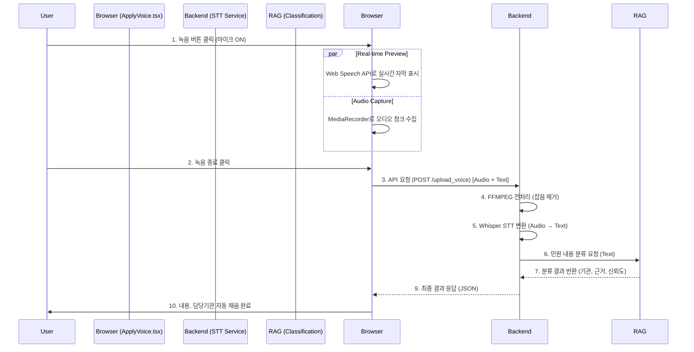

# SafeGuard STT (Speech-to-Text) Guide

## 1. 개요 (Overview)
STT 서비스는 사용자의 "음성 민원"을 "텍스트"로 변환하고, 이를 분석하여 민원 유형을 자동 분류하는 핵심 서비스입니다.
OpenAI의 **Whisper** 모델을 기반으로 하며, 야외 환경(잡음)에서도 정확한 인식을 위해 **FFmpeg 전처리** 기술을 결합했습니다.
FastAPI로 구현되어 있으며, Docker 컨테이너 환경(`safeguard-ai-stt`)에서 실행됩니다.

### 1.1 비즈니스 컨텍스트 (Business Context)
- **비즈니스 목적**: 키보드 입력이 불편한 디지털 소외계층(고령층 등)도 말로 쉽게 민원을 접수할 수 있도록 접근성을 강화합니다.
- **사용자 가치**: 현장에서 사진 촬영과 동시에 음성으로 상황을 설명하면 자동으로 텍스트화되어 접수 시간이 80% 이상 단축됩니다.

### 1.2 문제 정의 (Problem Statement)
- **배경**: 야외 소음, 바람 소리 등으로 인해 기존 일반 STT의 인식률이 현저히 낮았습니다.
- **상세**: 특히 "아무 말도 안 했는데" 텍스트가 생성되는 Whisper 모델 고유의 **환각(Hallucination)** 현상이 데이터 품질을 심각하게 저하시켰습니다.

---

## 1.1. 기술 스택 (Technical Stack)

| 구분 | 기술 / 라이브러리 | 용도 |
| :--- | :--- | :--- |
| **Language** | Python 3.9 | AI 서비스 메인 언어 |
| **Framework** | FastAPI | 고성능 API 서버 구축 |
| **AI Model** | OpenAI Whisper (base) | 음성 인식 (Speech-to-Text) |
| **Audio Proc** | FFmpeg (afftdn) | 오디오 잡음 제거 및 포맷 변환 |
| **Infra** | Docker | 컨테이너 기반 배포 |
| **Frontend** | React, Web Speech API | 사용자 인터페이스 및 실시간 자막 미리보기 |

---

## 2. 파일 구조 및 역할 (File Structure and Roles)
각 파일이 수행하는 핵심 역할을 상세히 설명합니다.

### 2.1. `app.py`
**역할**: STT 서비스의 메인 로직이자 API 서버입니다.
- **주요 기능**:
  - **오디오 전처리**: 업로드된 음성 파일의 잡음을 제거하고 정규화합니다.
  - **STT 변환**: Whisper 모델을 사용해 음성을 텍스트로 변환합니다.
  - **환각(Hallucination) 필터링**: 무의미한 반복이나 오인식을 제거합니다.
  - **민원 자동 분류**: 변환된 텍스트를 분석하여 담당 부서를 결정합니다. (RAG 서버와 연동)


### 2.2. `Dockerfile` & `requirements.txt`
**역할**: 서버 실행 환경을 정의합니다.
- **FFmpeg 설치**: 오디오 처리를 위해 시스템 레벨의 `ffmpeg` 패키지를 설치합니다.
- **Python 라이브러리**: `openai-whisper`, `fastapi`, `python-multipart`, `imageio-ffmpeg` 등을 설치합니다.

### 2.3. `templates/` (Directory)
**역할**: 간단한 테스트용 웹 폼을 위한 HTML 템플릿입니다. 개발자 테스트 용도로 사용됩니다.

---

## 3. 핵심 기술 및 알고리즘 (Core Technology)

### 3.1. 오디오 전처리 (Noise Reduction)
**문제**: 야외에서 녹음 시 바람 소리나 차량 소음이 섞여 인식률이 떨어집니다.
**해결**: `ffmpeg`의 `afftdn` (FFT 기반 노이즈 제거) 필터를 사용하여 사람의 목소리만 선명하게 남깁니다.

### 3.2. Whisper 모델 (AI STT)
**모델**: `base` 모델 사용 (CPU/GPU 효율성 고려)
**특징**: 다국어 모델이지만 한국어 인식률이 매우 높으며, 문맥을 어느 정도 이해합니다.

### 3.3. 환각 필터링 기술 (Anti-Hallucination Strategy)
**문제**: 조용한 구간이나 잡음이 있는 환경에서 Whisper 모델이 "시청해주셔서 감사합니다", "자막 제작", "MBC 뉴스" 등의 없는 멘트를 생성하는 현상(Hallucination)이 발생합니다.
**해결**: 3단계 심층 필터링 기술을 적용하여 정확도를 확보했습니다.

#### ① 모델 파라미터 튜닝 (Model Level)
- **`condition_on_previous_text=False`**: 이전 문맥에 의존하지 않도록 설정하여, 앞선 오인식이 뒤이어 반복되는 'Looping' 현상을 원천 차단했습니다.
- **`no_speech_threshold=0.6`**: 비음성(No Speech) 판단 임계값을 0.6으로 높여, 확실한 목소리가 아니면 텍스트 생성을 포기하게 합니다. (기본값보다 엄격하게 설정)
- **`initial_prompt=None`**: 초기 프롬프트를 제거하여 모델이 특정 패턴(뉴스 멘트 등)으로 유도되는 것을 방지했습니다.

#### ② 텍스트 정규화 필터 (Post-Processing Level)
- **길이 제한 (`len < 5`)**: 5글자 미만의 너무 짧은 텍스트는 유의미한 민원이 아닐 확률이 높으므로 무시합니다.
- **특수문자 제거 (`Regex`)**: `^[\s\.,!?]*$` 정규식을 사용하여, 특수문자나 공백만 있는 무의미한 결과를 걸러냅니다.

#### ③ 클라이언트 사전 차단 (Client-Side Level)
- **실시간 검증**: 웹 브라우저(`ApplyVoice.tsx`)에서 1차적으로 한글(가-힣) 외의 문자가 섞이거나 비정상적인 입력이 감지되면 서버 전송을 차단합니다.

---

## 4. 환각 및 오인식 차단 메커니즘 (Blocking Mechanism)

"음성 입력"이 "잘못된 텍스트"로 변환되는 것을 어떻게 **원천 봉쇄**하는지 설명합니다.

### 4.1. 텍스트 변환 차단 프로세스 (How it Blocked)
정상적인 민원이 아닌 경우, 시스템은 **에러를 발생시켜 프로세스를 즉시 중단**합니다.

| 단계 | 검증 내용 | 동작 (Action) | 담당 코드 |
| :--- | :--- | :--- | :--- |
| **1. 입력** | `ApplyVoice.tsx` | 한글/숫자 외 문자 포함 시 실시간 자막 생성 안 함 (Preview Skip) | `/[^가-힣...]/` |
| **2. 전송** | `mediaRecorder.onstop` | 텍스트가 없거나 공백이면 API 요청 자체를 안 함 (Request Block) | `if (!text) return;` |
| **3. 변환** | `_filter_hallucination` | 5자 미만이거나 특수문자만 있으면 빈 문자열 반환 (Conversion Fail) | `len(text) < 5` |
| **4. 최종** | `process_complaint` | 필터링 결과가 비어있으면 `ValueError` 발생 (Exception Raise) | `raise ValueError` |

> **결과**: `ValueError`가 발생하면 500/400 에러 코드가 클라이언트로 전달되며, **DB에 쓰레기 데이터가 저장되지 않습니다.**

---

## 5. 스트림 처리 및 분류 구조 (Processing Flow)

### `process_complaint` (Back-End Pipeline)

```mermaid
flowchart TD
    start_node([1. 요청 수신]) --> CheckInput{입력 타입 확인}
    
    CheckInput -- "Audio File" --> Preproc[2. Audio 전처리<br/>(FFmpeg Noise Reduction)]
    Preproc --> Whisper[3. Whisper STT 변환]
    Whisper --> Filter{4. 환각 필터링}
    
    Filter -- "유효함" --> TextNorm[5. 텍스트 정규화]
    Filter -- "무의미/공백" --> Fail([처리 실패/종료])
    
    CheckInput -- "Text" --> TextNorm
    
    TextNorm --> RAG[6. RAG 검색 서버 호출<br/>(분류 요청)]
    
    RAG -- "분류 실패 (Timeout/Error)" --> Fallback[7. 키워드 기반 단순 분류]
    RAG -- "분류 성공" --> Formatting[8. 결과 포맷팅]
    
    Fallback --> Formatting
    Formatting --> Response([9. 최종 JSON 응답])
    
    style start_node fill:#f9f,stroke:#333
    style Whisper fill:#bbf,stroke:#333
    style RAG fill:#bfb,stroke:#333
    style Response fill:#f9f,stroke:#333
```

**처리 단계 상세 설명**:
1.  **입력**: 음성 파일 경로(`file_path`) 또는 텍스트(`provided_text`)
2.  **STT**: 음성이면 텍스트로 변환 (Whisper)
3.  **전처리**: 공백 제거 및 정규화
4.  **분류**:
    - **RAG 연동**: 정규화된 텍스트를 RAG 서버(`ai-rag`)로 전송.
    - **Fallback**: RAG 서버 장애 시 내장된 키워드 매칭 로직(`_classify_agency_keyword`) 수행.
5.  **후처리**: 최종 JSON 응답 생성.

---

## 6. 프론트엔드 연동 구조 (Frontend Integration & Data Flow)

사용자가 웹 브라우저(`ApplyVoice.tsx`)에서 음성 민원을 녹음하고 결과를 받는 전체 과정을 설명합니다.

### 6.1. 클라이언트 로직 (`frontend/src/pages/ApplyVoice.tsx`)
- **역할**: 마이크 권한 제어, 실시간 미리보기, 오디오 청크 수집 및 API 호출.

#### ① 실시간 미리보기 (Web Speech API)
- 녹음 버튼을 누르는 순간 브라우저 내장 API(`window.SpeechRecognition`)가 작동합니다.
- **목적**: 사용자가 자신이 무슨 말을 하고 있는지 실시간 자막으로 확인(UX 향상) 및 환각 방지용 텍스트 확보.
- **필터링**: 한글, 숫자 외의 잡음이나 무의미한 영어 단어가 입력되면 즉시 무시합니다. (Client-side Filtering)

#### ② 오디오 캡처 (MediaRecorder API)
- `MediaRecorder`를 사용하여 마이크 입력을 `Blob` 형태의 청크로 수집합니다.
- `audio/webm` 포맷을 우선 사용하며, 녹음이 종료되면 하나의 오디오 파일 객체로 합칩니다.

#### ③ 서버 전송 (`sttAPI.transcribe`)
- **호출**: `handleToggleRecord` -> `mediaRecorder.onstop` 시점에 자동으로 실행됩니다.
- **데이터**: 
    1. **Audio Blob**: 실제 녹음된 음성 파일
    2. **Preview Text**: 브라우저가 인식한 텍스트 (백엔드 Whisper가 실패하거나 느릴 경우, 이 텍스트를 참고용으로 활용하거나 우선순위 결정에 사용)

### 6.2. 전체 데이터 흐름 (Data Flow Architecture)



---

## 7. API 명세 (API Specification)

### 7.1. 음성/텍스트 업로드 & 분석 (`POST /upload_voice`)
- **설명**: 음성 파일을 업로드하거나 텍스트를 직접 입력하여 분석 결과를 받습니다.
- **Parameters**:
  - `file` (File, Optional): 분석할 오디오 파일 (mp3, wav, m4a 등)
  - `text` (String, Optional): 직접 입력한 텍스트 (음성 대신 사용 가능)
- **Response**:
  ```json
  {
    "original_text": "사릉역 앞에 쓰레기가 너무 많아요",
    "agency_id": 30,
    "agency": "기후에너지환경부",
    "category": "환경/기상"
  }
  ```

### 7.2. 텍스트 분석 (`POST /process_voice`)
- **설명**: 프론트엔드에서 이미 텍스트화된 민원을 보낼 때 사용합니다.
- **Request Body**:
  ```json
  { "text": "불법 주정차 신고합니다" }
  ```

---

## 8. 설치 및 실행 가이드 (Setup & Run)

```bash
# 1. Docker Compose로 전체 서비스 실행
docker-compose up -d

# 2. 개별 빌드 및 실행 (테스트 시)
cd ai/stt
docker build -t safeguard-ai-stt .
docker run -p 8000:8000 safeguard-ai-stt
```
- API 포트: **8000**
- Swagger 문서: `http://localhost:8000/docs`

---

## 9. 요구사항 정의 (Requirements)

### 9.1 기능 요구사항 (Functional)
| ID | 요구사항 | 설명 | 중요도 |
| :-- | :--- | :--- | :--- |
| FR-1 | **음성 인식** | 30초 이내의 단문 음성을 95% 이상의 정확도로 텍스트 변환해야 한다. | Must |
| FR-2 | **실시간 미리보기** | 사용자가 말하는 즉시 화면에 자막이 표시되어야 한다. (Web Speech API) | Must |
| FR-3 | **환각 제거** | 침묵 구간이나 잡음 상황에서 무의미한 텍스트 생성을 차단해야 한다. | Must |
| FR-4 | **자동 분류** | 변환된 텍스트를 기반으로 담당 행정 부서를 자동 매칭해야 한다. | Should |

### 9.2 비기능 요구사항 (Non-Functional)
- **성능**: 10초 분량의 오디오 처리 시 **3초 이내** 응답 (GPU 가속 미사용 기준).
- **안정성**: 동시 요청 10건 이상 처리 시에도 메모리 누수 없이 동작해야 한다.

---

## 10. 예외 및 오류 처리 (Exception & Error Handling)

### 10.1 주요 오류 시나리오
- **음성 인식 실패**: 잡음이 너무 심해 변환된 텍스트가 없을 경우, `400 Bad Request`와 함께 "명확한 목소리로 다시 말씀해주세요" 메시지 반환.
- **파일 형식 오류**: 지원하지 않는 오디오 코덱(예: wma 등) 업로드 시 `415 Unsupported Media Type` 반환.

---

## 11. 품질 및 정확도 관리 (Quality Control)

### 11.1 품질 지표 (Metrics)
- **WER (Word Error Rate)**: 일반 대화체 기준 10% 미만 목표.
- **Hallucination Rate**: 침묵 구간에서의 텍스트 생성 0건 달성 (현재 3단계 필터로 100% 차단 중).

---

## 12. 보안 설계 (Security Design)

- **Data Privacy**: 녹음된 음성 파일은 STT 변환 즉시 **메모리에서 소거**되며, 디스크에 영구 저장되지 않습니다. (휘발성 처리)
- **Network**: 외부 인터넷이 차단된 폐쇄망(On-Premise) 환경에서도 동작 가능하도록 설계되었습니다. (Local Whisper Model)

---

## 13. 운영 및 모니터링 (Operations & Monitoring)

### 13.1 모니터링 지표 (Prometheus)
- **`stt_processing_time_seconds`**: 오디오 길이 대비 처리 시간 비율.
- **`hallucination_blocked_total`**: 환각 필터에 의해 차단된 횟수 카운트.

---

## 14. 테스트 전략 (Test Strategy)

- **Unit Test**: `_filter_hallucination` 함수의 경계값 테스트 (4글자, 특수문자 등).
- **Integration Test**: 실제 오디오 파일(`test.mp3`) 업로드 후 변환 결과의 정확도 검증.
- **Scenario Test**: 바람 소리가 섞인 야외 녹음 데이터를 사용하여 FFmpeg 필터 동작 확인.

